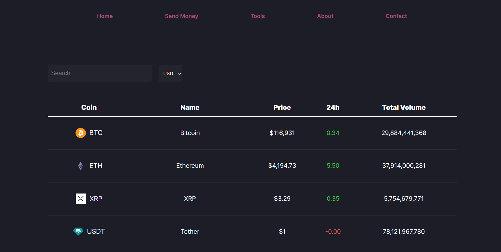
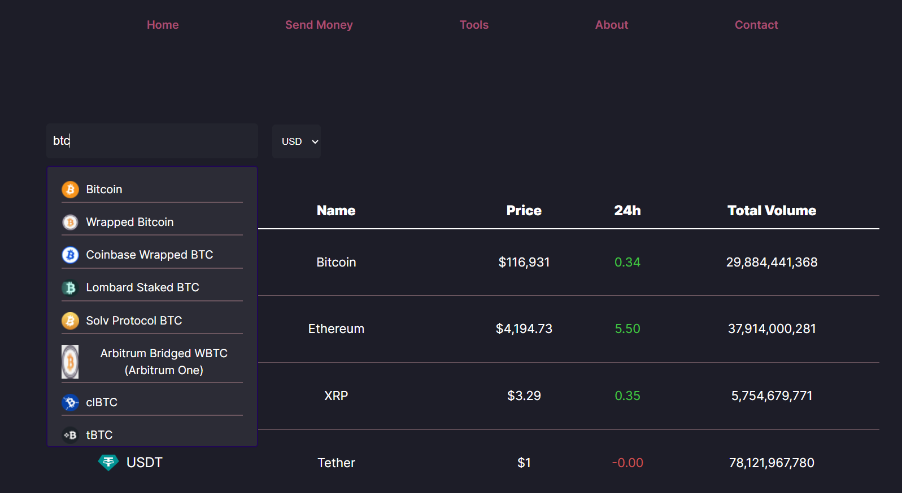
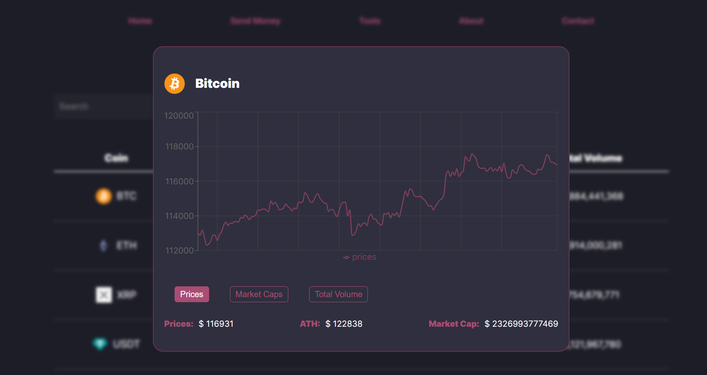

# Crypto Project 💸

Welcome to **Crypto Project**, a modern web application built with React and Vite to provide real-time cryptocurrency data and insights. This project leverages external APIs to fetch live crypto prices, market trends, or other relevant data, offering a fast and responsive user experience.

## Table of Contents
- [About the Project](#about-the-project)
- [Features](#features)
- [Technologies Used](#technologies-used)
- [API Integration](#api-integration)
- [Screenshots](#screenshots)
- [Installation](#installation)
- [Usage](#usage)
- [Contributing](#contributing)
- [License](#license)
- [Contact](#contact)

## About the Project
Crypto Project is a React-based application designed to help users explore cryptocurrency data in a user-friendly interface. Whether you're tracking prices, analyzing market trends, or learning about digital currencies, this project provides a seamless experience powered by Vite for fast development and external APIs for real-time data.

### Why This Project?
- Demonstrates modern React development with Vite for rapid builds and hot module replacement (HMR).
- Integrates with cryptocurrency APIs to fetch live data.
- Open-source and open for contributions to enhance features and functionality.

## Features
- Search for cryptocurrencies and view summary info
- View price chart and detailed info for each coin
- Coin list table with currency switch (USD, EUR, JPY)
- Pagination and scroll-to-top icon
- Modern, responsive UI

## Screenshots
Explore the Pastry Project through these snapshots:

| Homepage | Market Trends | Coin Details |
|----------|--------------|------------|
| |  |  |

## Getting Started

1. Clone the repository:
   ```bash
   git clone https://github.com/USERNAME/REPO_NAME.git
   cd REPO_NAME
